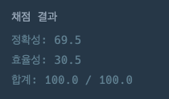

### 문제 풀이
짝을 짓는 짝짓기 문제이므로, stack을 활용해서 푸는 방법을 적용했다.
짝이 맞는 경우 stack 저장되었던 값을 제거함으로써, 최종적으로 stack이 비어있는지에 대한 여부를 확인하고, 비어 있는 경우 짝을 맞춘 경우이므로 true를 return 해주었고, 그렇지 않은 경우 false를 return 해주었다.
만약 시작부터 닫힌 괄호가 나오는 경우는 무조건 false이므로, 별도로 조건 분기 처리를 해주었다.

### 채점 결과
